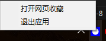

## 这是什么东西
### 这是一个可以在局域网中的网络收藏夹，也就是收藏夹，完全是用gemini 写的，因为我啥页不会

## 怎么用？
### 很简单，直接运行dist文件夹下面的 [text](dist/MyWebBookmarkAppTray.exe) 系统托盘会有图标，有退出和打开选项 或者也可以直接访问 本地访问 http://127.0.0.1:5000 端口5000 局域网也可以访问，但是注意防火墙。

### 因为我啥也不会，这个只是AI 写的，所以如果有大佬不小心看到这个请随便嘲笑并提出不足，我会努力不改。
# 真难啊